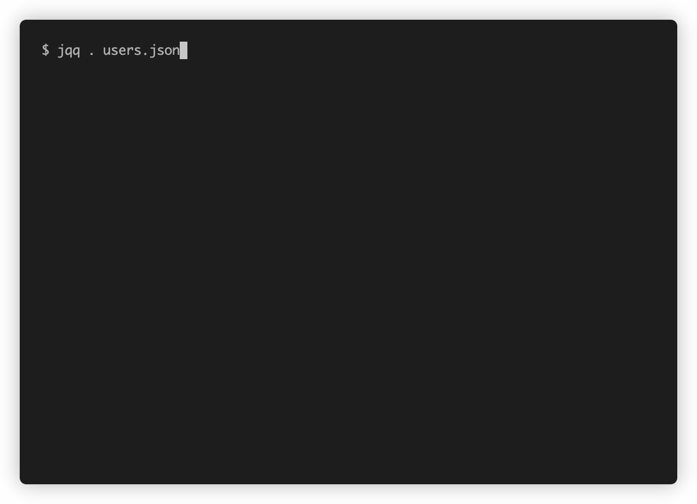

# jqq

jq Querier: an interactive wrapper around `jq`

## Requirements

* [jq](https://github.com/stedolan/jq)
* Modern-ish ruby

## Installation

* Clone this repository
* `bundle install`
* Optionally: add a nice alias to your `~/.profile` or equivalent:

```
alias jqq="/path/to/jqq.rb"
```

## Usage

```
Usage: jqq <expr> <file>
```

## Demo



## Keybindings

jqq uses readline-like keybindings:

| Keybinding | Action |
| ---------- | ------ |
| Enter | re-evaluate expression |
| `ctrl-a` | goto beginning of line |
| `ctrl-e` | goto end of line |
| `ctrl-k` | kill line (delete to end of line) |
| `ctrl-d` | delete next character |

## Future Work

* smart window resize support (re-run only if needed)
* stdin support
* rewrite in another language
* colors!

## License

[BSD](LICENSE)
